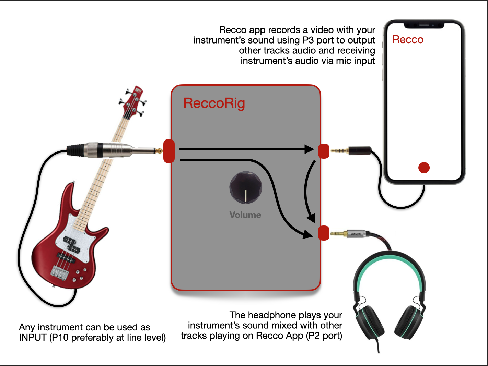
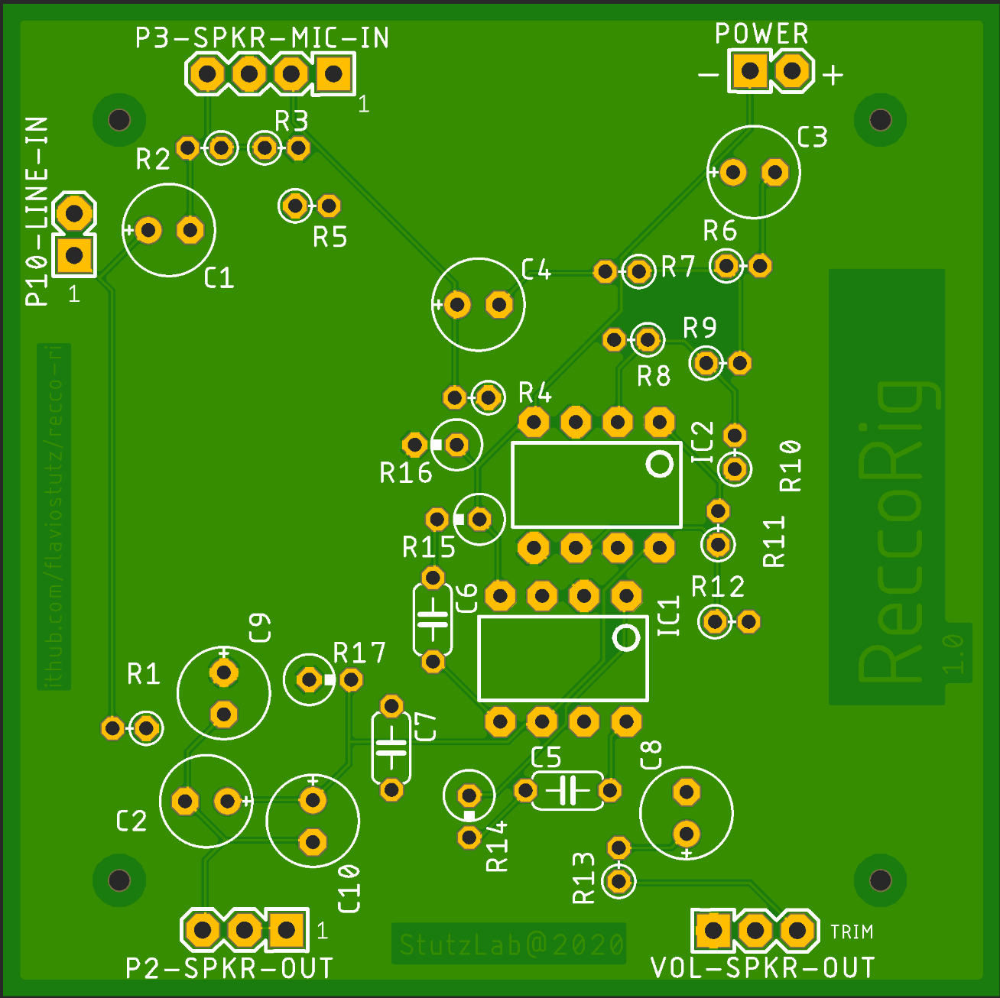
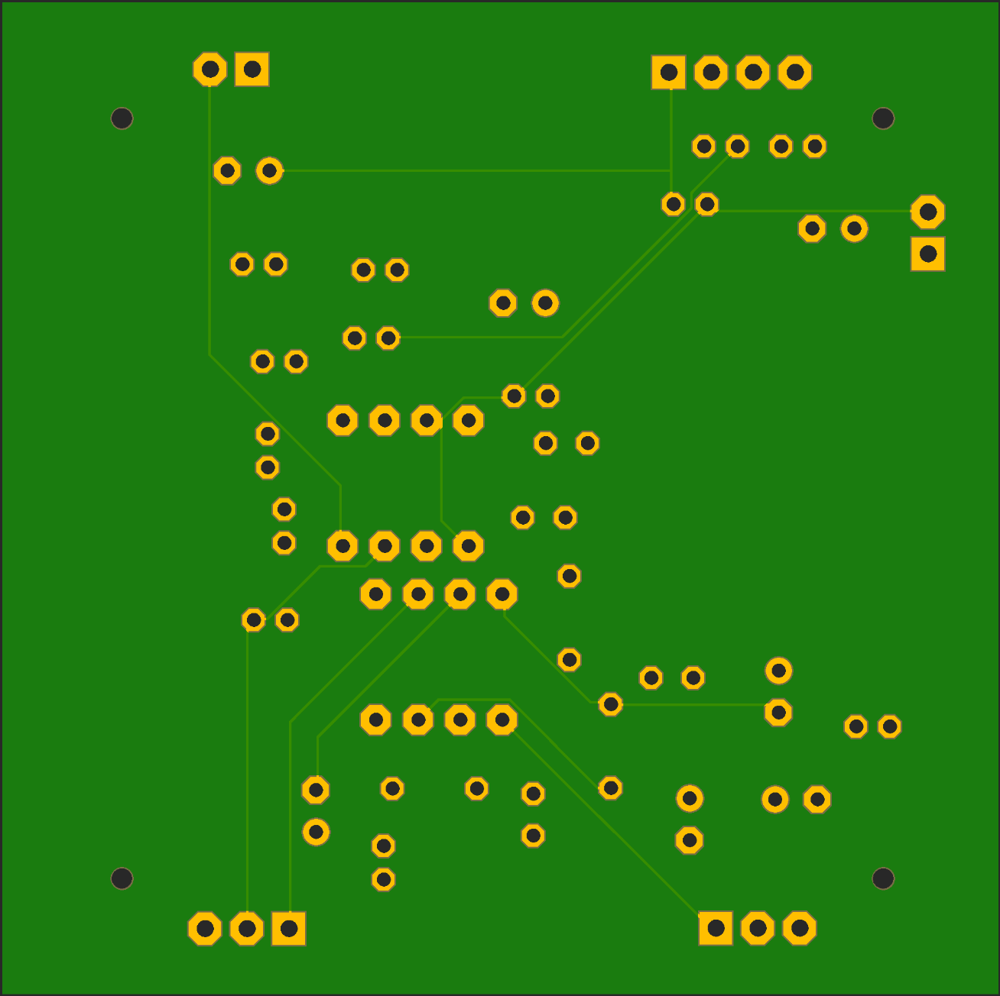

# recco-rig
This is a board to help musicians perform recordings along with Recco App.

## Board

The board schematics was created using the free version of Eagle.

To install it, go to https://www.autodesk.com/products/eagle/free-download

### Top

### Bottom

